# Analyser — User Guide

> **Version:** 2.2 · **Last updated:** June 2026

Analyser is a browser-based tool for inspecting and comparing `.fit` activity files from Garmin devices and other ANT+ sensors. It runs entirely in your browser — no account, no upload, no server. Files are parsed locally.

---

## Table of Contents

1. [Getting Started](#1-getting-started)
2. [The Interface](#2-the-interface)
3. [Device Comparison — Single File](#3-device-comparison--single-file)
   - 3.1 [Device Toggle Bar](#31-device-toggle-bar)
   - 3.2 [Charts Tab](#32-charts-tab)
   - 3.3 [Summary Tab](#33-summary-tab)
   - 3.4 [Mean/Max Tab](#34-meanmax-tab)
   - 3.5 [Map Tab](#35-map-tab)
   - 3.6 [Record Filter](#36-record-filter)
8. [Athlete Profile](#8-athlete-profile)
   - 8.1 [Opening the Profile Panel](#81-opening-the-profile-panel)
   - 8.2 [Profile Fields](#82-profile-fields)
   - 8.3 [How the Profile Is Used](#83-how-the-profile-is-used)
4. [Device Comparison — Multiple Files](#4-device-comparison--multiple-files)
   - 4.1 [Loading Multiple Files](#41-loading-multiple-files)
   - 4.2 [Different-Session Files](#42-different-session-files)
   - 4.3 [Multi-File Device Bar](#43-multi-file-device-bar)
   - 4.4 [Fine-Tuning Timing](#44-fine-tuning-timing)
5. [Event Comparison](#5-event-comparison)
   - 5.1 [Custom Segments](#51-custom-segments)
6. [Exporting Data](#6-exporting-data)
   - 6.1 [CSV Export](#61-csv-export)
   - 6.2 [Excel Export](#62-excel-export)
   - 6.3 [PNG Chart Export](#63-png-chart-export)
7. [Syncing Device Labels Across Devices](#7-syncing-device-labels-across-devices)
   - 7.1 [How Sync Works](#71-how-sync-works)
   - 7.2 [Linking a Second Device](#72-linking-a-second-device)
   - 7.3 [Sync Status and Errors](#73-sync-status-and-errors)
   - 7.4 [Resetting Your Sync Identity](#74-resetting-your-sync-identity)
8. [Sharing a Session View](#8-sharing-a-session-view)
9. [Reference](#9-reference)

---

## 1. Getting Started

Open Analyser in your browser. You are greeted with the landing page, which contains a drop zone and a file picker.

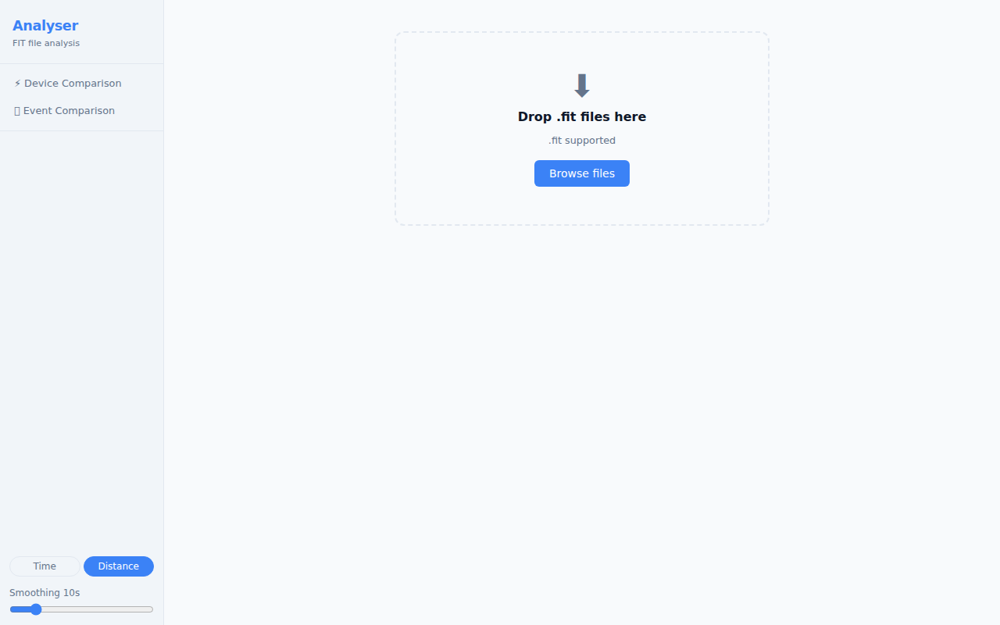

**To load a file:**

- **Drag and drop** one or more `.fit` files onto the drop zone, or
- Click **Choose files** to open the system file picker.

You can load **up to 6 files** at once.

While each file is being processed, a **progress card** appears showing the current stage (Parse → Normalise → Detect → Build) and an estimated time remaining. Parsing runs in the background — the UI stays fully responsive. You can click **✕** on any card to cancel that file. Once all files are parsed they appear in the sidebar and you are taken directly to the **Device Comparison** view.

> **Supported format:** `.fit` (Flexible and Interoperable Data Transfer — the standard format exported by Garmin watches, Wahoo computers, and most ANT+ devices). Files from `.tcx` and `.gpx` sources are not currently supported.

---

## 2. The Interface

After loading a file, the application has two main views:

| View | What it shows |
|------|---------------|
| ⚡ **Device Comparison** | Sensor streams from one or more files displayed side-by-side on a shared time or distance axis |
| 🏃 **Event Comparison** | Two or more runs of the same course aligned by distance, showing where time was gained or lost |

The **Device Comparison** view (described in sections 3–4) is the primary view and opens automatically when you load a file.

### Navigation

On a **desktop** browser, the two views are accessible from the left sidebar. Click **⚡ Device Comparison** or **🏃 Event Comparison** to switch modes.

On a **tablet or phone**, the sidebar is hidden by default. Tap the **☰ menu button** in the top-left corner to slide out the navigation drawer. Tap any item or tap outside the drawer to close it. You can also swipe left across the drawer to close it.

On a **phone** (narrow screen), a **bottom navigation bar** appears at the foot of the screen with the same ⚡ Device and 🏃 Event buttons for quick switching without opening the drawer.

### Toolbar Controls

On tablet and phone, the toolbar controls (Device Toggle Bar, Channel Toggle Bar, Fine-tune timing) are hidden behind a collapsible panel. Tap the **Devices & Options** (or **Channels & Options**) button to expand or collapse the controls. On desktop the controls are always visible.

### Athlete Profile

The **⚖ Profile** toggle is in the bottom of the sidebar (or navigation drawer). Click it to expand a panel where you enter your training thresholds (weight, FTP, Critical Power, maximum heart rates, LTHR). These values are saved in your browser and used to add zone context to charts and summary tables. See [section 8](#8-athlete-profile) for details.

### Theme

The **Theme** control is in the bottom of the sidebar (or navigation drawer), between the X-axis toggle and the Smoothing slider.

| Option | Behaviour |
|--------|-----------|
| **🖥 Sys** (default) | Follows your operating system's dark/light preference |
| **☀ Lit** | Forces the light theme regardless of OS setting |
| **🌙 Drk** | Forces the dark theme regardless of OS setting |

Your choice is saved in your browser and restored the next time you open Analyser.

---

## 3. Device Comparison — Single File

Loading a single file opens the Device Comparison view with all detected sensor streams active.

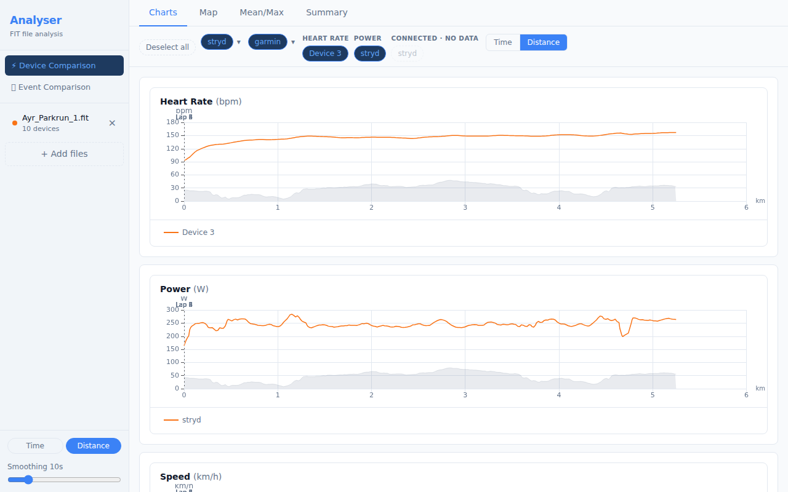

The view is divided into:

- **Left sidebar** — navigation and file controls
- **Device Toggle Bar** — sensors detected in the file, grouped by channel
- **Tab panel** — Charts, Summary, Mean/Max, and Map tabs

---

### 3.1 Device Toggle Bar

The Device Toggle Bar sits at the top of the content area and lists every sensor stream detected in the loaded file.

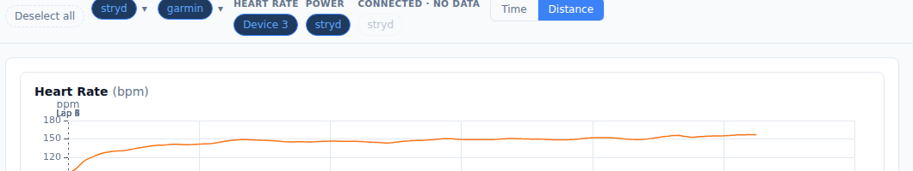

**Key concepts:**

- Each **pill** represents one device contributing to a channel (e.g. a Polar H10 contributing Heart Rate).
- **Active** devices (highlighted in blue) are included in all charts and statistics. Click a pill to toggle it on or off.
- Channels with a **✦** indicator have data from two or more devices — these are directly comparable.
- **Multi-metric devices** (devices recording 3+ channels, such as a Garmin watch) appear as a single expandable pill. Click the **▾** arrow to see the individual channels.
- Devices that were connected but recorded no data are shown as dashed, semi-transparent pills and cannot be toggled.

**Data quality warnings:**

When Analyser detects sensor anomalies (signal spikes, data dropouts, or GPS drift), a red **⚠ N** badge appears next to the affected channel label, where N is the number of anomaly events detected. Hover the badge to see a breakdown (e.g. "2 spikes, 1 dropout"). If GPS position anomalies are detected, a separate **GPS ⚠ N** section appears at the bottom of the bar. See [section 3.2](#32-charts-tab) for anomaly markers on charts and [section 3.5](#35-map-tab) for GPS drift circles on the map.

**Renaming a device:**

Double-click any device pill to rename it. Type the new label and press **Enter** to confirm, or **Escape** to cancel. Labels are saved locally in your browser and are restored automatically the next time you load a file from the same device — this works for all device types, including Garmin watches, Stryd pods, ANT+ sensors, and BLE devices.

**Undoing a rename:**

Press **Ctrl+Z** (Cmd+Z on macOS) at any time to undo the most recent device rename. Press **Ctrl+Shift+Z** (or **Ctrl+Y**) to redo. A brief notification confirms each undo or redo. The undo history is in-memory only — it is cleared when you refresh the page.

**Rename history popover:**

Hover over any device pill to see a compact history popover listing the last 5 renames for that device (old name → new name, with relative timestamps). If the most recent global rename was for this device, an **↩ Undo last rename** button appears at the bottom of the popover for mouse-only users.

---

### 3.2 Charts Tab

The Charts tab displays time-series data for every active channel.

**Reading the charts:**

- Each chart plots one channel (e.g. Heart Rate, Power, Pace).
- The **X axis** is either elapsed time or distance — toggle between them with the **Time / Distance** buttons at the top.
- Multiple devices contributing to the same channel each appear as a separate line.
- **Pace** uses an inverted Y axis — faster pace (lower min/km) appears higher on the chart, which matches the intuition of "going faster". Pace is only shown for running activities; it is suppressed for cycling files where it is not meaningful.

**Interacting with the charts:**

| Action | Effect |
|--------|--------|
| Hover | Tooltip shows exact values across all series at that position |
| Click + drag | Zoom in on a time/distance range |
| Double-click | Reset zoom |
| Scroll wheel | Zoom in/out (all charts stay synchronised) |

**Lap markers** appear as faint vertical lines across all charts. Hover a marker to see the lap number and split time.

**Per-series statistics:**

Below each chart, a compact stats row shows the **minimum**, **average**, and **maximum** for every active device series:

- Each entry is colour-coded with a dot matching the chart line so you can immediately associate the number with the series.
- Pace values are formatted as M:SS. Because pace is an inverted metric (lower min/km = faster), the labels are reversed: **max** shows the fastest pace and **min** shows the slowest, displayed as `max / avg / min`. Numbers still read ascending left-to-right.
- Hover any entry to see the exact sample count and x-axis range it covers.
- **Zoom-aware:** when you zoom into a region, the stats recalculate using only the visible data. Zoom back out (or double-click) to see full-activity stats.

> **Note:** Stats in this row reflect the current smoothing and axis mode (distance or time) and may differ slightly from the Summary tab, which uses the raw unsmoothed data from the original file.

**Data quality markers:**

When Analyser detects sensor anomalies in the active channel, red **◆ diamond markers** appear on the chart at the positions where anomalies occurred. These highlight:

- **Spikes** — brief, implausibly high values (e.g. a momentary heart rate reading of 220 bpm)
- **Dropouts** — gaps where the sensor stopped transmitting (value 0 or absent for 10+ seconds mid-activity)

**Click a diamond marker** to zoom the chart to ±15 seconds (or ±50 metres in distance mode) around the anomaly, making it easy to inspect the surrounding data in context. Double-click the chart to zoom back out.

> GPS drift anomalies (where the GPS signal jumped to an implausible position) are shown on the **Map tab** as red circles, not on time-series charts.

**Zone shading:**

When you have configured an [Athlete Profile](#8-athlete-profile), the Charts tab adds subtle background shading to relevant channels:

- **Heart Rate** — five colour bands (Z1–Z5) are drawn based on your sport-specific maximum heart rate (or LTHR when maxHR is absent). The bands update automatically if you change the profile.
- **Power (running)** — five CP zone bands are drawn when you have set a Critical Power value and the activity is a running file with Stryd power data.
- **Power (cycling)** — FTP zone bands (Coggan model) are drawn when you have set an FTP value and the activity is a cycling file. The number of bands adapts to your data:
  - **5 bands (Z1–Z5)** — shown when all power values stay below 120% FTP. The y-axis is clipped to the top of Z5, keeping the chart compact for aerobic rides.
  - **7 bands (Z1–Z7)** — shown when any power value exceeds 120% FTP (i.e. data reaches Z6 or Z7). The y-axis auto-scales to your data so Z6 and Z7 shading is fully visible. The open-ended Z7 band is capped at 120% of your maximum recorded power to avoid stretching the chart excessively.

Zone bands are drawn per-series — when multiple activities are loaded each series uses its own sport's zone model. Zone bands are absent until the relevant profile field is configured, so they never appear uninvited.

**Smoothing:**

A smoothing control lets you apply a rolling average to reduce sensor noise. Increase the window (in seconds) to smooth out spikes; set it to 1 s for raw data. Smoothing applies to all channels simultaneously.

---

### 3.3 Summary Tab

The Summary tab shows aggregate statistics for every active device and channel.

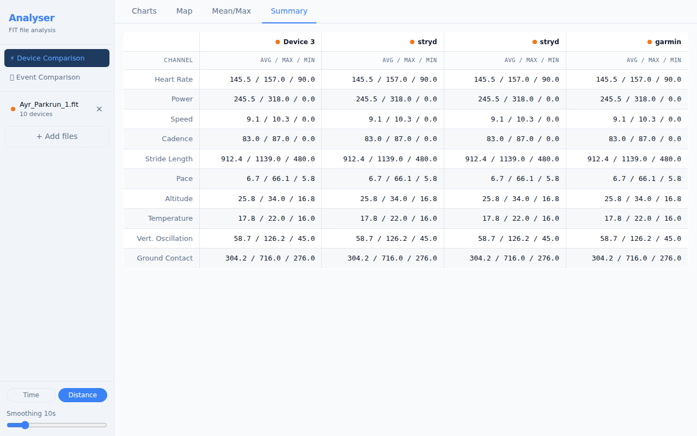

For each channel, the table shows:

| Column | Meaning |
|--------|---------|
| **Device** | The sensor that recorded this channel |
| **Avg** | Time-weighted average over the active portion of the activity |
| **Max** | Peak value recorded |
| **Total** | Cumulative value (distance, calories) — shown where applicable |

**Athlete Profile context columns** — when you have configured an [Athlete Profile](#8-athlete-profile), additional columns appear alongside the average:

| Column | When shown | Meaning |
|--------|-----------|---------|
| **% FTP** | Cycling power + FTP set | Average power as a percentage of your FTP |
| **% CP** | Running power + CP set | Average power as a percentage of your Critical Power |
| **w/kg** | Any power + weight set | Average power divided by body weight |
| **Zone** | Heart Rate + maxHR or LTHR set | HR zone (Z1–Z5) of the average HR using the sport-appropriate threshold |

**Additional rows for Stryd activities** — when Stryd power data is present, the Summary tab shows two extra rows:

| Row | When shown | Meaning |
|-----|-----------|---------|
| **Form Power ratio** | Stryd file loaded | Form Power as a percentage of total power — lower is more efficient |
| **Running Stress Score (RSS)** | Stryd file + CP set | Session load score analogous to TSS; measures training stress relative to your Critical Power |

These columns and rows are absent when the relevant profile fields are not set, so the table stays clean for users who have not configured a profile.

Toggling devices in the Device Toggle Bar updates the Summary table immediately.

---

### 3.4 Mean/Max Tab

The Mean/Max tab plots the **best average power** (or other metric) over every possible duration, from one second up to the full activity length.

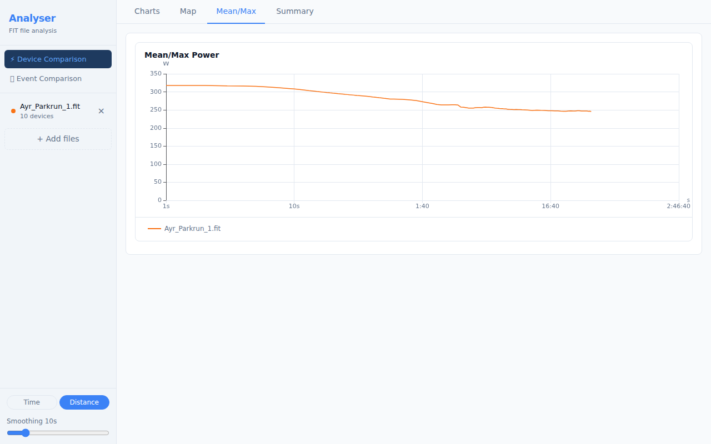

This is the standard "Critical Power curve" or "Power Duration curve" used in cycling and running:

- The Y axis is the best average power achieved for the duration on the X axis.
- A high, flat curve indicates sustained high output; a steep drop-off indicates strength over short durations but limited endurance.
- When multiple files are loaded, each file produces its own curve — load two sessions to compare fitness progress.

**Athlete Profile overlays** — when you have configured an [Athlete Profile](#8-athlete-profile), the Mean/Max chart gains two optional overlays:

- **FTP / CP reference line** — a dashed horizontal line at your FTP (cycling) or Critical Power (running) lets you see exactly where on the curve your threshold sits. It is labelled "FTP" for cycling and "Critical Power" for running.
- **w/kg secondary axis** — when body weight is set, a second Y axis on the right shows watts per kilogram, making it easy to compare across different body weights or reference published w/kg benchmarks.

Both overlays are absent when the relevant profile fields are not configured.

---

### 3.5 Map Tab

The Map tab renders the GPS route recorded in the activity.

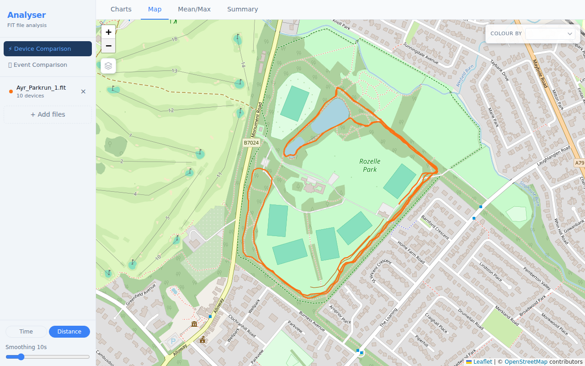

**Tile layers:**

A **Map Layer** panel is always visible in the **top-left** corner of the map. Click any layer name to switch the base map:

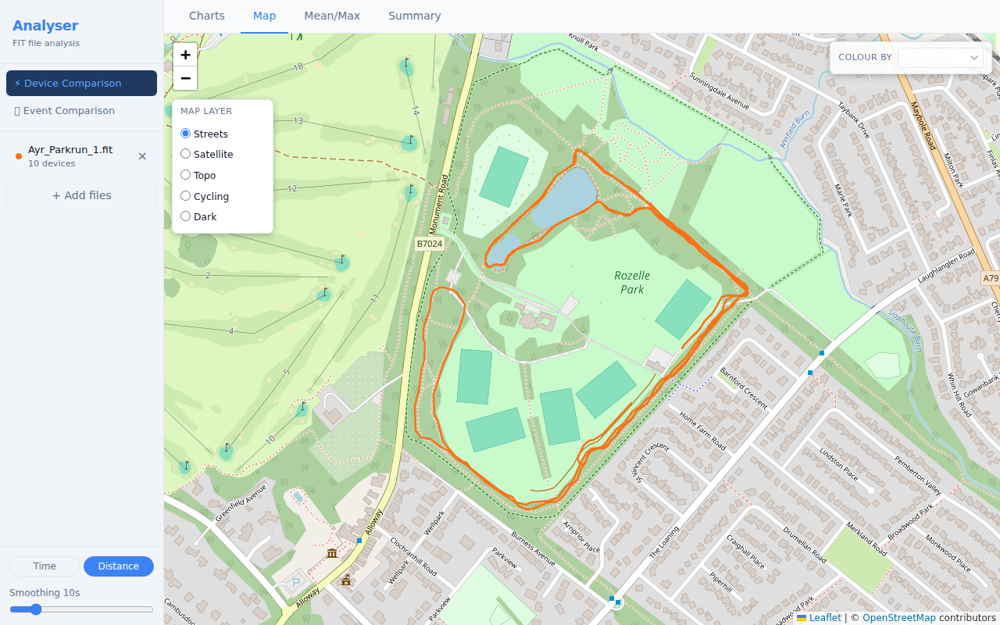

| Layer | Best for |
|-------|---------|
| **Streets** (default) | Road runs, orientating yourself |
| **Satellite** | Seeing the actual terrain |
| **Topo** | Hilly routes — contour lines visible |
| **Cycling** | Bike-specific road markings |
| **Dark** | Low-glare, high-contrast viewing |

**GPS drift indicators:**

If Analyser detects GPS position anomalies (points where the GPS signal jumped to an implausible location), small **red circles** appear on the map route at those positions. Hover a circle to see the implied speed that triggered the detection. These markers help you identify segments where GPS accuracy was poor, so you can discount those portions of the route.

**Metric colouring:**

Use the **Colour by** dropdown in the **top-right** of the map to shade the route by a metric such as pace, heart rate, or power. A legend appears in the bottom-right corner showing the value range or zone boundaries.

- **Gradient mode** (default) — a continuous blue-to-red colour ramp scaled to the min/max values recorded in the activity. The legend shows the minimum and maximum values.
- **Zone mode** — discrete zone colours matching the chart zone palette. A **Gradient | Zones** toggle appears beside the dropdown when heart rate or power is selected and the relevant athlete profile threshold is set (maxHR or LTHR for heart rate; Critical Power for running power; FTP for cycling power). The legend shows each zone's colour swatch and boundary range (e.g. "Z1: <111 bpm", "Z2: 111–130 bpm"). Zone mode is greyed out with an explanatory tooltip when no threshold is configured.

**Power source labels:** When a file contains Stryd running power, the dropdown entry reads **Stryd Power** rather than generic "Power". Files with native watch running power show **[Manufacturer] Running Power** (e.g. "Garmin Running Power"). Cycling power files show **Power**.

**Hover tooltip:** Hovering over a metric-coloured segment shows the distance, metric value, and unit. In zone mode the active zone number is appended (e.g. "2.34 km · 162 bpm Z4").

**Multi-file mode:** When two or more files are loaded, the **Colour by** picker expands to show one row per file, each labelled with the filename and a colour dot. Each file can have an independent metric and mode selection. Legends stack vertically in the bottom-right, one per file that has a metric selected.

**Metric strip chart:**

When you select a metric in the **Colour by** dropdown, a strip chart slides in below the map showing that channel's values plotted against **distance**. The strip chart occupies approximately 30% of the map panel height; the map retains the remaining 70%.

- Select **None** in the dropdown to hide the strip chart and return the map to full height.
- On **tablet and phone** the strip chart is collapsed by default — tap the **Metric Chart ▾** header to expand it.
- A **line / gradient** toggle button in the strip chart header switches between a standard line and a spectral gradient style that matches the map route colouring (single-file only; gradient is disabled when multiple files are loaded).

**Bidirectional hover sync:**

The map and strip chart are linked in both directions:

- Hover over the **map route** — a crosshair appears on the strip chart at the corresponding distance.
- Hover over the **strip chart** — the position marker on the map moves to the corresponding GPS location on the route.
- Move off either surface to clear the cursor on the other.

**Hover interaction (Charts tab):**

Hovering over the map route also shows a crosshair on all open Charts-tab charts, letting you pinpoint exactly what your metrics were at a specific GPS location.

---

---

### 3.6 Record Filter

The **Filter** button in the toolbar lets you highlight specific portions of an activity — threshold power efforts, climbing sections, high-cadence intervals, or any combination — while greying out everything else.

**Opening the filter panel:**

Click the **Filter** button in the toolbar (next to the Device Toggle Bar). A compact dropdown panel appears. An active filter count badge (e.g. **2**) appears on the button when any constraint is set.

**Setting a filter:**

Each row in the panel has a channel label and two numeric inputs (**Min** and **Max**). Fill in one or both to constrain that channel. You can constrain multiple channels simultaneously — records must pass all active constraints to be highlighted.

| Channel | Unit | Notes |
|---------|------|-------|
| Pace / Speed | min/km (running) or km/h (cycling) | Label switches automatically based on activity type |
| Power | W | Label shows the power source: **Stryd Power**, **Running Power**, or **Power** |
| Heart Rate | bpm | |
| Cadence | spm (running) or rpm (cycling) | |
| Gradient | % | Derived from altitude + distance. Only shown when altitude data is available. |

Charts update in real time as you type — no apply button needed. Records that pass the filter are shown at full colour; records that fail are dimmed to grey.

**Zone preset buttons:**

When you have set up an [Athlete Profile](#8-athlete-profile), zone preset buttons (`Z1`, `Z2`, … up to `Z5` for HR/CP or `Z7` for FTP) appear below the Power and Heart Rate rows. Click a zone button to fill in the exact boundary values for that zone immediately.

**Named presets:**

At the top of the panel, quick-access preset pills appear based on your profile:

| Preset | What it does |
|--------|-------------|
| **Above CP** | Filters to records where power ≥ your Critical Power (running) |
| **Z4+ FTP** | Filters to records where power ≥ 90% of your FTP (cycling) |
| **Z4+ HR** | Filters to records where heart rate is in zone 4 or above |
| **Climbing** | Filters to records where gradient ≥ 2% |
| **Downhill** | Filters to records where gradient ≤ −2% |

Presets that require profile fields you haven't set are hidden automatically.

**Invert filter:**

Tick the **Invert filter** checkbox to flip the logic — records that would normally be greyed out become the highlighted ones. This is useful for viewing everything *except* a particular effort (e.g. "show me everything that isn't a sprint").

**Clearing the filter:**

Click **Clear all** in the panel footer, or click the × on each constraint individually. When no constraints are set, the badge disappears and all records are shown at full colour. Closing the panel (clicking outside it) does not clear the filter — the active filter persists while you work.

> **Note:** The filter applies to the Charts tab time-series only. The delta plot and segment bar chart in Event Comparison always use full-course data so that split comparisons remain meaningful.

---

## 4. Device Comparison — Multiple Files

Analyser supports loading up to **6 files simultaneously**, enabling you to compare sensor data across different activities or devices.

### 4.1 Loading Multiple Files

Select multiple `.fit` files in the file picker (hold Shift or Cmd/Ctrl to select more than one), or drag and drop multiple files onto the drop zone at once.

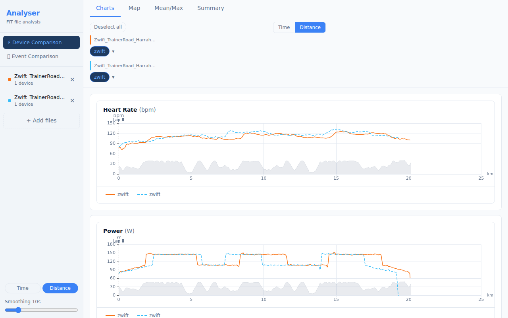

> **Note:** If the loaded files are from different sessions (start times more than 1 hour apart), Device Comparison will be unavailable — see [section 4.2](#42-different-session-files).

---

### 4.2 Different-Session Files

Device Comparison is designed for files recorded **during the same session** — for example, two devices worn simultaneously on the same run. Comparing files from completely different activities (different days, different events) produces charts with no meaningful relationship between the data streams.

If you load two or more files whose start times are more than 1 hour apart, Analyser detects this and shows an explanation panel instead of charts:

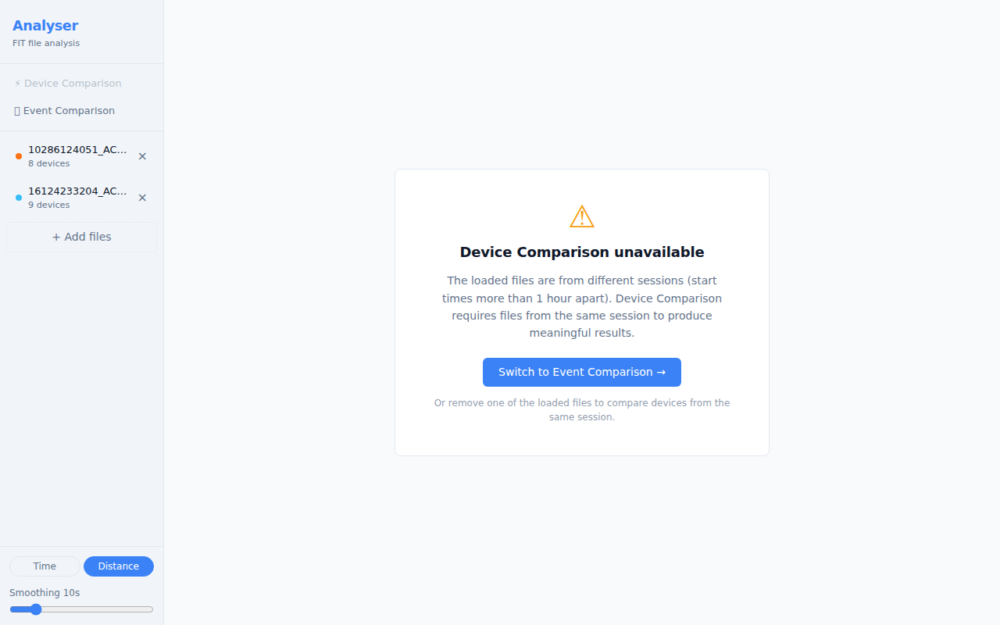

The **⚡ Device Comparison** button in the sidebar also appears greyed-out with a tooltip explaining why it is unavailable.

**What to do:**

- Click **Switch to Event Comparison →** to use the 🏃 Event Comparison view, which is designed for comparing runs of the same course across different sessions.
- Or remove one of the loaded files (using the × button in the sidebar) until the remaining files are from the same session.

Once the remaining files overlap in time (within 1 hour), Device Comparison becomes available again automatically.

---

### 4.3 Multi-File Device Bar

In multi-file mode the Device Toggle Bar groups sensors by their source file, with a coloured left-border header for each file.

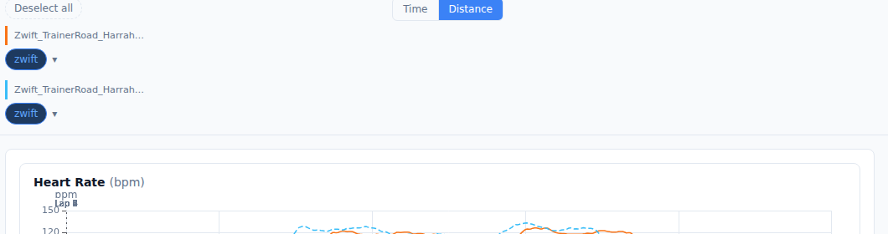

- Each file gets a unique **colour** (blue, orange, green, purple, …). All chart series from that file share the same colour.
- Channels with data from two or more files display the **✦** comparable indicator — these are the most valuable channels to compare.
- Use the **Select all / Deselect all** button to quickly show or hide everything.

---

### 4.4 Fine-Tuning Timing

Even when files are from the same session, GPS clocks sometimes drift by a few seconds. The **Fine-tune timing** control lets you shift any file forwards or backwards in time to align the traces precisely.

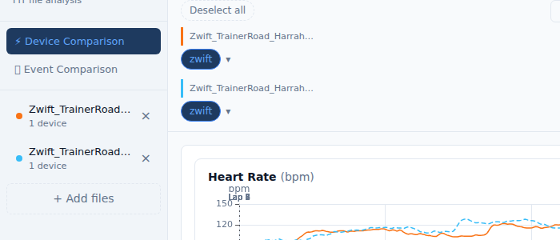

Click the **⏱ Fine-tune timing** button (below the Device Toggle Bar, visible in multi-file + time-axis mode) to expand the panel. This control is only relevant when files are from the **same session** — if they are from different sessions, the gate panel is shown instead (see [section 4.2](#42-different-session-files)).

| Control | Function |
|---------|---------|
| **−10 / −1** buttons | Shift the file 10 s or 1 s earlier |
| **+1 / +10** buttons | Shift the file 1 s or 10 s later |
| **Numeric input** | Type an exact offset in seconds |
| **↺** (Reset) | Return to the GPS-anchored auto-computed offset |

The first loaded file is always the **reference** (offset = 0). All other files are shifted relative to it. The offset is shown in the **N adjusted** badge on the toggle button.

**Anchor source badge:**

Next to each filename in the expanded panel, a small coloured badge shows how Analyser determined the auto alignment for that file:

| Badge | Colour | Meaning |
|-------|--------|---------|
| **Timer** | Blue | Aligned to the FIT timer-start event — highest accuracy |
| **GPS move** | Blue | Aligned to the first GPS record with movement — typical outdoor |
| **GPS fix** | Amber | Aligned to the first GPS fix (stationary) — slightly less precise |
| **File start** | Grey | No GPS and no timer — aligned by file start time only |
| **Workout** | Green | Aligned to the first structured workout step (indoor) |
| **Indoor** | Green | Aligned to the first movement detected (speed/power/cadence) |

Blue and green badges indicate good-quality alignment. An amber or grey badge on one file while others are blue or green may explain a small residual offset — use the nudge buttons to correct it.

**Location mismatch warning:**

If Analyser detects that the GPS start points of the loaded files are more than 50 m apart, an amber banner appears at the top of the charts area:

> ⚠ GPS anchor points are more than 50m apart — these files may be from different locations. Distance comparison may not reflect a shared course.

This can occur if you accidentally loaded files from two different events. Dismiss the banner with the **✕** button, or remove the mismatched file from the sidebar.

**Indoor and mixed-session warnings:**

When Analyser detects that some or all of the loaded files are indoor activities (turbo trainer, treadmill, Zwift, TrainerRoad), it shows one of two banners:

| Situation | Banner | Effect |
|-----------|--------|--------|
| Indoor + outdoor files loaded together | ⚠ Amber warning | Distance mode disabled — the Distance button is greyed out with a tooltip. The axis switches to Time automatically. |
| All files are indoor (2+ files) | ℹ Blue info | Informational only — distance comparison still works but values are device-estimated, not GPS-measured. |

Both banners are dismissible and reset automatically when you change the loaded files.

---

## 5. Event Comparison

The **Event Comparison** view (🏃) is designed for comparing multiple runs of the same course — for example, several parkruns on the same route — aligned by **distance** to show exactly where time was gained or lost.

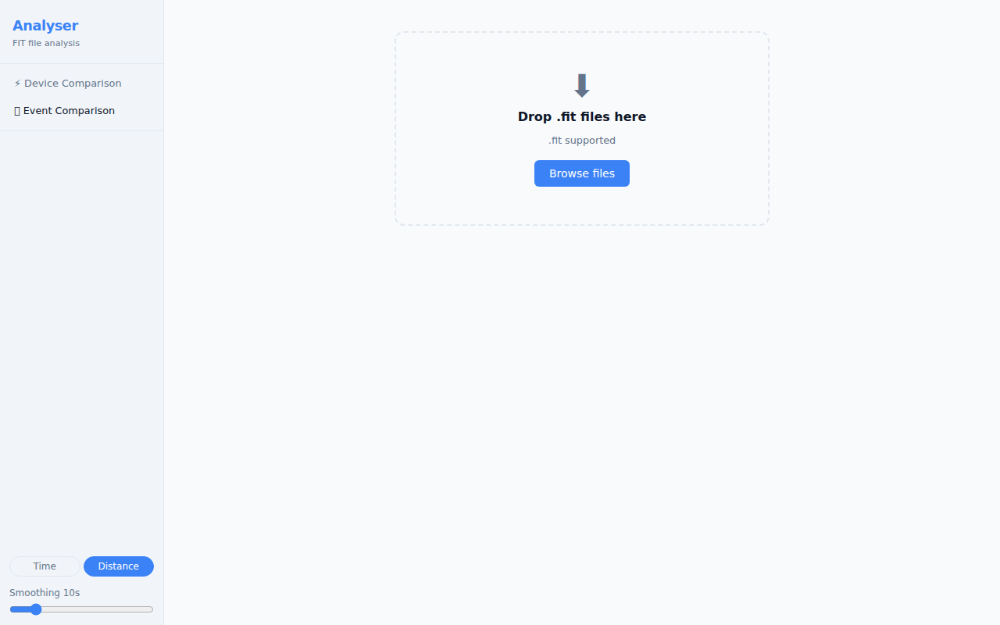

Load two or more `.fit` files, then switch to the Event Comparison tab. The view provides:

- **Time delta plot** — cumulative seconds gained or lost versus distance. Positive values mean you were ahead of the reference run; negative values mean you were behind.
- **Overlaid time-series charts** — pace, speed, heart rate, and power for all files on a shared distance axis.
- **Segment bar chart** — per-kilometre or per-lap time difference, plus any custom segments you have defined.

> **Tip:** Select a reference run using the controls in the sidebar. The time delta is calculated relative to the reference. Try different reference runs to understand where you consistently gain or lose time.

### 5.1 Custom Segments

You can define your own named course sections — a known climb, a flat finishing straight, a technical descent — and compare your performance on each across all loaded files.

Custom segments are saved per course and reloaded automatically the next time you open files from the same event.

**Creating a segment:**

1. On any time-series chart (Pace, Heart Rate, Power, etc.), hold **Shift** and click-drag across the range you want.
2. A blue selection band appears while you drag.
3. Release the mouse. A dialog box prompts you to **name** the segment.
4. Type a name and press **Enter** (or click **Save**) to confirm. Press **Escape** to cancel.

The segment immediately appears in the **Segment** tab bar alongside auto-laps, with full per-file statistics (time, pace, power, heart rate).

**Resizing a segment:**

Hover near the left or right edge of a segment band on any chart. The cursor changes to a resize arrow. Click-drag to move that boundary. The segment is updated as soon as you release.

**Managing segments:**

Click the **Segments ▾** button in the toolbar to open the Segment Manager. Here you can:

| Action | How |
|--------|-----|
| Rename a segment | Click the segment name and type a new one |
| Delete a segment | Click the **✕** button next to the segment |
| Export segments | Click **Export JSON** to download all course segments |
| Import segments | Click **Import JSON** and choose a previously exported file |

> **Note:** Segments are keyed by sport and approximate distance (rounded to the nearest 100 m). A 5 km parkrun recorded as 5.01 km and one recorded as 4.98 km are treated as the same course, so segments defined in one session appear in both. If you load files from a significantly different distance (e.g. a 10 km race), a separate segment set is maintained.

---

## 6. Exporting Data

Analyser can export your loaded activity data in three formats: a CSV file, an Excel workbook, and PNG screenshots of individual charts.

---

### 6.1 CSV Export

The tab bar on both the Device Comparison and Event Comparison pages contains a **CSV / Excel** format toggle and an **Export Data** button. CSV is selected by default.

Clicking **Export Data** with CSV selected downloads a plain-text `.csv` file immediately — no server involved.

**File structure:**

- **Single file loaded** — one header row followed by one row per recorded data point. No activity column.
- **Multiple files loaded** — one header row followed by all records from all files in load order. An `activity` column (the source filename) is prepended as the first column so rows can be filtered by file in any spreadsheet tool.

**Columns:**

| Column | Description |
|--------|-------------|
| `activity` | Source filename — only present when multiple files are loaded |
| `Timestamp` | ISO 8601 date-time of the sample (e.g. `2026-01-15T09:00:00.000Z`) |
| `Elapsed (s)` | Seconds since activity start |
| `Distance (m)` | Cumulative distance in metres |
| *(channel columns)* | One column per channel with at least one non-null value across all loaded files |

The same channel columns as Excel apply: Heart Rate (bpm), Power (W), Cadence (rpm), Speed (km/h), Pace (min/km), Altitude (m), Temperature (°C), and others where available. Channels with no data in any loaded file are omitted. Pace values are formatted as **M:SS strings** (e.g. `5:15`).

The file uses **RFC 4180 formatting**: CRLF line endings, quoted fields where values contain commas or quotes.

**Downloaded filename:** `analyser-export-YYYY-MM-DD.csv` using your local date.

---

### 6.2 Excel Export

Select **Excel** in the format toggle, then click **Export Data** to download an `.xlsx` workbook — no server involved.

**Workbook structure:**

| Sheet | Contents |
|-------|---------|
| **Summary** | One row per loaded file: filename, sport, start time, total distance (km), and elapsed time |
| **Per-activity sheets** | One sheet per file, named after the filename (truncated to 31 characters; duplicates are suffixed `(2)`, `(3)`, etc.) |

**Per-activity sheet columns:**

Each activity sheet contains one row per recorded data point with the following columns:

- **Timestamp** — wall-clock date and time of the sample (Excel datetime format)
- **Elapsed (s)** — seconds since the activity start
- **Distance (m)** — cumulative distance in metres
- One column per channel that has at least one non-null value: Heart Rate (bpm), Power (W), Left Power (W), Right Power (W), Cadence (rpm), Speed (km/h), Pace (min/km), Altitude (m), Temperature (°C), Core Temperature (°C), Skin Temperature (°C), Vertical Oscillation (mm), Ground Contact Time (ms), Stride Length (m)

Channels with no data at all in a given file are omitted from that file's sheet. Pace values are formatted as **M:SS strings** (e.g. `5:15`) rather than decimal numbers.

**Downloaded filename:** `analyser-export-YYYY-MM-DD.xlsx` using your local date.

---

### 6.3 PNG Chart Export

Every chart card has a **⬇ PNG** download button in its header row. Clicking it downloads a PNG screenshot of that chart at **2× pixel density** for sharp rendering on high-DPI displays.

The PNG uses the chart's current theme (light or dark) as the background, so what you see is what you get.

**Downloaded filenames** follow the pattern `channel-name-YYYY-MM-DD.png` (e.g. `heart-rate-2026-05-26.png`).

PNG export is available for all four chart types: Time Series, Mean/Max, Time Delta, and Segment Bar.

---

## 7. Syncing Device Labels Across Devices

Device labels you create (by double-clicking a sensor pill) are saved in your browser's local storage. The **Sync** feature lets you share those labels across multiple browsers or devices — for example, so your phone and laptop both show "Polar H10" instead of "Device 1".

Sync is **automatic and account-free**. No sign-in is required. Each browser is assigned a private sync identity (a UUID stored in local storage) the first time it loads Analyser.

### 7.1 How Sync Works

1. On first load, Analyser generates a unique sync identity (UUID) for your browser and pushes your current labels to a cloud key-value store under that identity.
2. On every subsequent load, Analyser pulls the latest labels from the cloud and applies them locally — the cloud is the source of truth.
3. Whenever you rename or remove a device label, the change is automatically pushed to the cloud in the background.
4. All data is keyed by your private UUID. No one else can read or modify your labels without that UUID.

> **Privacy note:** Labels are stored in Upstash Redis and expire automatically after **90 days** of inactivity. No personal information is stored — only the device labels you assign (e.g. "Polar H10", "Assioma Duo") keyed by a randomly generated UUID.

### 7.2 Linking a Second Device

To share your labels with a second browser or device:

1. Open the **Sync** panel in the sidebar footer (click the ☁ Sync toggle).
2. On the first device:
   - **Scan the QR code** with the second device's camera app — this opens Analyser with the sync identity pre-loaded.
   - Or click **📋 Copy link** and paste the URL into the second device's browser.
   - Or note the **short sync code** (format: `XXX-XXXXX`, e.g. `E6Y-NXEMF`).
3. On the second device, open Analyser and expand the Sync panel:
   - If you used the QR code or copied link, Analyser automatically pulls labels from the first device's identity — no further action needed.
   - If using the short code, type it into the **Link another device** input and press **→** (or Enter). Analyser resolves the code and pulls labels.

After linking, both devices share the same sync identity and labels stay in sync automatically.

> **Tip:** The QR code and copy-link methods are the most convenient. Use the short code when typing a URL isn't practical.

### 7.3 Sync Status and Errors

The Sync panel shows a status line:

| Status | Meaning |
|--------|---------|
| ☁ Syncing across devices ✓ · *N min ago* | Labels synced successfully; time since last sync |
| Setting up sync… | Initial sync in progress (first visit) |
| ⚠ Sync error — retry | A push or pull failed; click **retry** to try again |

Network errors are non-fatal — if a push fails, your local labels are unchanged and the error is shown in the panel. Analyser will retry automatically on the next label change.

### 7.4 Resetting Your Sync Identity

If you want to **break the link** between devices (e.g. after lending your laptop to someone):

1. Open the Sync panel and click **Reset sync identity** at the bottom.
2. Confirm when prompted.

A new UUID is generated and your current labels are pushed under the new identity. Devices still using the old identity will no longer receive your label updates.

> **Note:** Resetting does not delete the old identity from the cloud — it simply stops being used. The old data will expire after 90 days of inactivity.

---

## 8. Sharing a Session View

The **Copy session link** button in the sidebar footer lets you capture your current view configuration as a URL and share it with anyone. When the recipient opens the link and loads the same (or equivalent) activity files, they see the same setup you had — no manual configuration needed.

**What travels in the link:**
- Which devices are active (matched by physical sensor identity, not file-specific IDs)
- Active channels (Event Comparison mode)
- Smoothing level
- X-axis mode (time or distance)
- Active tab (Charts, Summary, Mean/Max, or Map)
- Which mode was open (Device Comparison or Event Comparison)

**What does not travel in the link:**
- Athlete profile values (weight, FTP, CP, HR thresholds) — these are personal data and stay local
- Device labels — use the Sync feature (section 7) to share those separately

**To share your session view:**

1. Load your files and configure the view (select devices, set smoothing, switch to the tab you want the recipient to land on).
2. Click **Copy session link** in the sidebar footer (a small link icon below the Sync panel). The button briefly changes to **✓ Copied!** to confirm the link is on your clipboard.
3. Paste and send the URL to the recipient.

**When the recipient opens the link:**

The link encodes the full view configuration as a compact `?v=` parameter in the URL. When the recipient opens the link, Analyser reads the parameter and stores the configuration. As soon as they load their own files, the stored configuration is applied automatically — active devices are matched to their files by sensor identity (ANT+ number, serial, or manufacturer/product), and all other settings (smoothing, tab, mode) are applied immediately.

If a device key from the link doesn't match any loaded sensor, it is silently skipped — the rest of the configuration still applies. If the `?v=` parameter is missing, malformed, or from a future version of Analyser, it is ignored and the app loads with its defaults.

> **Note:** The session link encodes view state only — it does not include the activity data itself. The recipient must load their own copy of the `.fit` files to see any charts.

---

## 8. Athlete Profile

The Athlete Profile stores your personal training thresholds locally in your browser. Once set, the thresholds are used to add zone context to charts and the summary table — no account required and no data is sent to any server.

### 8.1 Opening the Profile Panel

Click the **⚖ Profile** toggle in the sidebar footer (or navigation drawer on tablet/phone). The panel expands to reveal six numeric input fields. Click the toggle again to collapse it.

Your settings are saved automatically when you leave each field (press **Enter** or click away). Leaving a field blank removes that threshold — the corresponding overlays disappear immediately.

> **Tip:** Validation warnings appear in amber below any field with an implausible value (e.g. FTP above 600 W, weight below 30 kg). These are non-blocking — the value is still saved. Correct the figure if it was a typo.

### 8.2 Profile Fields

| Field | Unit | Used for |
|-------|------|---------|
| **Weight** | kg | w/kg column in Summary tab; w/kg secondary axis on Mean/Max chart |
| **FTP** (Functional Threshold Power) | W | % FTP column in Summary tab; FTP reference line on Mean/Max chart (cycling) |
| **Max HR — Cycling** | bpm | HR zone badge in Summary tab; zone shading on HR chart (cycling activities) |
| **CP** (Critical Power) | W | % CP column in Summary tab; Critical Power reference line on Mean/Max chart (running) |
| **Max HR — Running** | bpm | HR zone badge in Summary tab; zone shading on HR chart (running activities) |
| **LTHR** (Lactate Threshold HR) | bpm | Fallback HR zone source when maxHR is not set; uses a standard 92% maxHR estimate |

**Sport routing:** For the HR zone badge and chart shading, Analyser uses your cycling maxHR for cycling activities and your running maxHR for running activities. If the primary maxHR for a sport is absent, it falls back to the other sport's maxHR, then to LTHR. This means a single maxHR entry provides zone context for both cycling and running if you have not configured them separately.

### 8.3 How the Profile Is Used

| Where | What changes |
|-------|-------------|
| **Charts tab — Heart Rate chart** | Z1–Z5 background shading bands based on sport-appropriate maxHR (or LTHR estimate) |
| **Charts tab — Power chart (running)** | Z1–Z5 CP zone shading bands (Stryd power only) |
| **Charts tab — Power chart (cycling)** | Adaptive FTP zone shading: Z1–Z5 for aerobic efforts (≤120% FTP); Z1–Z7 when data reaches Z6/Z7 (>120% FTP) |
| **Summary tab — Power rows** | % FTP (cycling) or % CP (running) column; w/kg column |
| **Summary tab — Heart Rate row** | Zone badge (Z1–Z5) |
| **Summary tab — Form Power ratio** | Stryd activities: Form Power as % of total power |
| **Summary tab — Running Stress Score** | Stryd activities + CP set: session RSS score |
| **Mean/Max tab** | FTP or Critical Power dashed reference line; w/kg secondary Y axis |

All overlays and columns are silently absent when the relevant profile field is not configured. Loading a file with no matching power or HR data is unaffected.

---

## 9. Reference

### Sync — Quick Reference

| Action | How |
|--------|-----|
| Open Sync panel | Click **☁ Sync** in the sidebar footer |
| Share labels with another device | QR code, Copy link, or short code |
| Enter a short code | Type `XXX-XXXXX` in the **Link another device** input and press → |
| Break the link / start fresh | **Reset sync identity** in the Sync panel |
| Check last sync time | Status line in the Sync panel |

### Keyboard Shortcuts

| Key | Action |
|-----|--------|
| **Double-click** a chart | Reset zoom |
| **Double-click** a device pill | Begin renaming that device |
| **Enter** (in rename input) | Confirm device rename |
| **Escape** (in rename input) | Cancel device rename |
| **Ctrl+Z / Cmd+Z** | Undo the most recent device rename |
| **Ctrl+Shift+Z / Ctrl+Y** | Redo the last undone rename |
| **Escape** (with history popover open) | Close the rename history popover |
| **Enter** (in offset input) | Confirm time offset |

### Supported Sensor Types

| Sensor | Channels recorded |
|--------|------------------|
| Heart Rate Monitor (HRM) | Heart Rate |
| Power Meter (bike) | Power, Left/Right balance |
| Stryd Running Power | Power, Form Power, Ground Contact Time, Stride Length |
| Core Body Temperature | Core Temperature, Skin Temperature |
| Speed/Cadence Sensor | Speed, Cadence |
| Running Dynamics Pod | Vertical Oscillation, Ground Contact Time, Stride Length |
| Watch / Primary device | All remaining channels: GPS, Altitude, Speed, Pace, Temperature |

### File Limits

- **Maximum files per session:** 6
- **Supported format:** `.fit` (ANT/Garmin FIT protocol)
- All parsing happens **locally in your browser** — no data is uploaded to any server.

### Troubleshooting

| Symptom | Likely cause | Fix |
|---------|-------------|-----|
| File loads but no charts appear | No sensor data in the file | Check the Device Toggle Bar — all devices may be deselected or no-data |
| Device Comparison shows "unavailable" panel | Files are from different sessions (start times >1 hour apart) | Use **Event Comparison** (🏃) to compare runs of the same course, or remove the out-of-session file |
| Two same-session files don't align on the time axis | GPS clock drift between devices | Check the anchor source badges in Fine-tune timing (section 4.4); files with grey or amber badges may need a small manual nudge |
| Location mismatch warning appears | Files are from different GPS locations (anchors >50 m apart) | Check the files loaded — you may have mixed files from different events; dismiss the banner or remove the mismatched file |
| Map shows no route | FIT file has no GPS data | Some indoor activities (pure TrainerRoad, treadmill) do not record GPS. Zwift files do have a map (virtual route). |
| Distance button greyed out | Indoor and outdoor files loaded together | Distance axes are incompatible — use Time mode for this comparison, or load only one type of activity |
| "All files are indoor" banner appears | All loaded files are indoor activities | Informational only — distance comparison still works but is device-estimated. Dismiss or ignore. |
| Pace chart looks upside-down | Expected — faster pace (lower min/km) is plotted higher | This is correct; it matches the intuition of "going faster = higher on chart" |
| Device name shows as "Device N" | Device not yet labelled | Double-click the pill to rename it; the label is saved in your browser and restored for future sessions with any device of the same type |
| Sync panel shows "⚠ Sync error" | Network error or server unavailable | Click **retry** in the Sync panel; your local labels are unaffected |
| Short code entry says "Code not found" | Code is invalid, mistyped, or the 90-day TTL has expired | Check the code format (`XXX-XXXXX`) and re-copy it from the originating device |
| Labels on second device are out of date | Sync has not triggered yet | Open the Sync panel — pulling happens automatically on load; refresh the page if needed |
| Custom segments not appearing in Event Comparison | Files may be from a different course length | Segments are keyed by sport + distance (±100 m). Check that the loaded files match the course the segments were created for. |
| Segment dialog did not appear after Shift+drag | Drag may have been too small | Try dragging a wider range (at least a few hundred metres). The dialog appears on mouse release. |
| Filter button has a badge but charts look unchanged | Charts may still be loading or the filter is set to a range with no matching records | Check that the filter values correspond to data in the loaded file (e.g. a power min above the activity's max power will grey out everything) |
| Gradient row is missing from the Filter panel | Activity has no altitude data | The gradient filter is automatically hidden for files that contain no altitude readings (e.g. some indoor recordings) |
| Closing the Filter panel cleared my filter | The panel closing does not clear the filter — the badge on the button will still show the count | Use **Clear all** inside the panel to remove all constraints |
| Sync panel shows "Setting up sync…" for a long time | Connectivity issue on first visit | Check your network; the sync identity is assigned locally first so labels still work offline |

---

*Screenshots taken using real activity files: Ayr Parkrun and Zwift/TrainerRoad sessions.*
